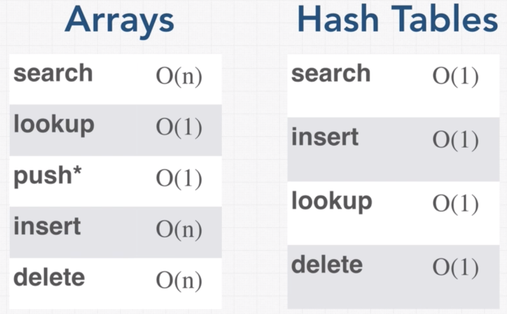

# Hash Tables

[This video is very helpful](https://www.youtube.com/watch?v=KyUTuwz_b7Q)

**Hash tables (HT)** are arguably the single most important data structures in existence. Used to implement everything from _objects_ in JavaScript and _dictionaries_ in Python to Memcached over a distributed computer network, hash tables are beloved by programmers for providing key/value storage with constant big-O time complexity for insertion, deletion, and access.

## What is Hash Tables?

**Hash table** is simply an array with its elements indexed by a _hashed key_, or a key => value look up.

In other words, **Hash Table** is a data structure that allows us to very fast retrieval of data no matter how much data there is.

Like arrays, hash tables are initialized to a fixed size and _inserting_, _deleting_, and _reading elements_ within those boundaries can be accomplished in constant time, or O(1).

## How Does It Work

Just like arrays Hash Tables use indexes but Hash Tables use a function to relate the value to the index. So in Hash Table the is related to the value some how.

In this diagram, you can see the key (a string) is run through a hash function which produces an integer 0-15 which is used as the index in a 16-element array.

## What is a hash function?

A function that generates a value for each input that gets. In other words, function is a calculation to a key to transform into a address. 

For numeric keys, divide the value by the number of available of addresses, n, and take the remainder.

> Address = _value_ Mod _n_
(n is number of available addresses)

Another method is the folding method, divides value into equal parts together;
* like a telephone number 07444112656 to 74 44 11 26 56 = 212.
* depending the size of the table divide the total and take the remainder as a key.

## Collisions

It is possible for hash function to create same key for different values, this cause collisions.

The more items there are in the hash table, the more likely you are to get collisions when you insert even more data.

One way to deal with this is to create Hash Table bigger that it needed. For instance only 70% of the table can be used. 

Total numbers of items stored divided by the size of array know as **Load Factor**

Collisions resolved with open and closed addressing.

**Open Addressing**

Every location is open to any item. open addressing can use variety of techniques to decide where to place an item that doesn't go where it should. An example can be **Linear Probing** if the calculated address is occupied then a linear search is used to find the next available slot.

* **Linear Probing**,
If the key is not available function check for the next index, and so on. If the the function comes to end and cannot find a empty index it can cycle around to the beginning of the table. 

**Closed Addressing or Chaining**

When the collision occurs the new value can be linked to the existing value.

> on Linear Probing to look an item a linear search should be implemented if the was a collision, but on Chaining there are fewer links to the value that has a collusion so it is faster that Linear Probing.

