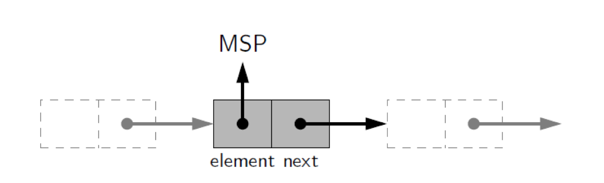
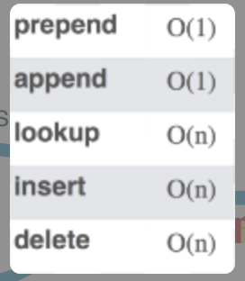
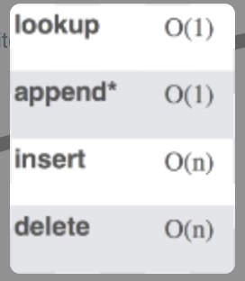
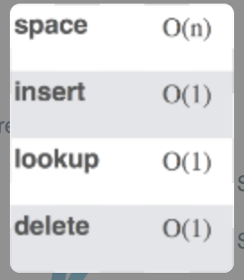
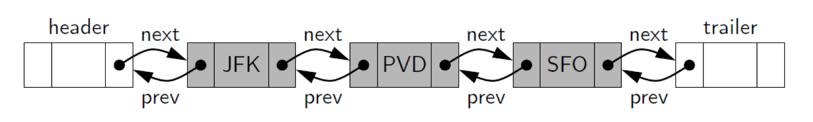
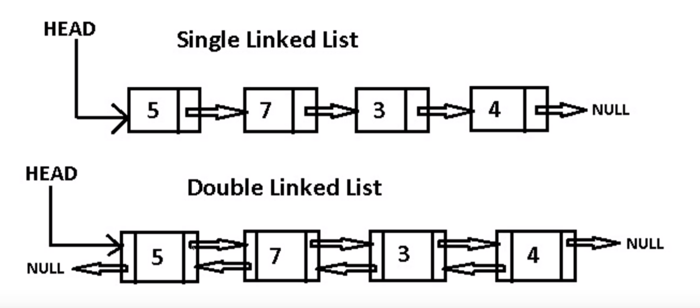
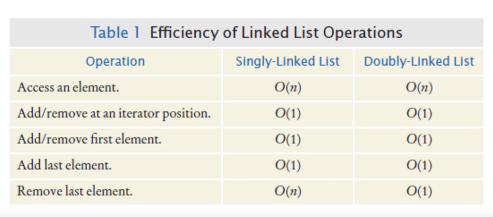
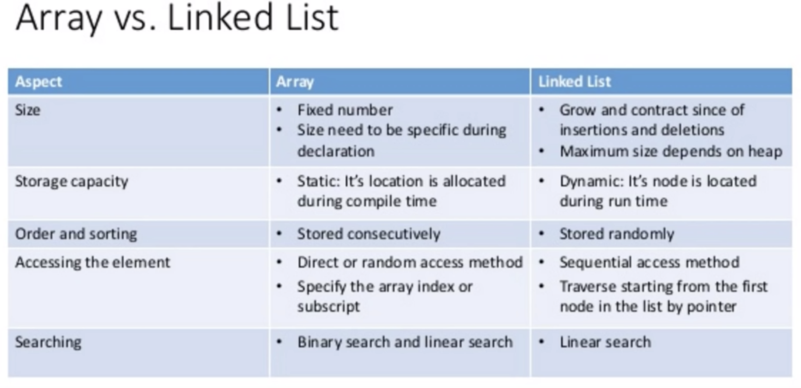

# Linked Lists
**Linked list** is a string of values or nodes, sort of like a string of pearls, with each key containing both data and a reference to the next node in the list.

## Signly Linked List

**Singly linked list** is a collection of nodes (values) that collectively form a linear sequence.



It is a simple class with a short constructor:

```Python
class Node(object):
    def __init__(self,data):
        self.value = data
        self.next_node = None
```

This works enough to link nodes together:

```Python
a = Node(1)
b = Node(2)
c = Node(3)
a.next_node = b
b.next_node = c
```
This code link the nodes together.

In a Linked List the first node is called the **head** and the last node is called the **tail**. Let's discuss the pros and cons of Linked Lists:

### Pros
> * Fast Insertion
> * Fast Deletion
> * Ordered
> * Flexible Size

* The main advantage of using a linked list over a similar data structure, like the static array, is the linked list’s **dynamic memory allocation**

* Linked Lists have constant-time insertions and deletions in any position, in comparison, arrays require O(n) time to do the same thing.

* Linked lists can continue to expand without having to specify their size ahead of time (remember our lectures on Array sizing form the Array Sequence section of the course!)

### Cons
> * Slow Lookup
> * More Memory

* To access an element in a linked list, you need to take O(k) time to go from the head of the list to the kth element. In contrast, arrays have constant time operations to access elements in an array.

### Linked List BigO

### Array BigO

### Hash Table BigO


## Doubly Linked List

In a doubly linked list, we define a linked list in which each node keeps an explicit reference to the node before it and a reference to the **node** after it. 



_ref: https://www.youtube.com/watch?v=JlMyYuY1aXU_

Only difference between these two **Doubly Linked List** contains pointer to prior element as well as the next.


